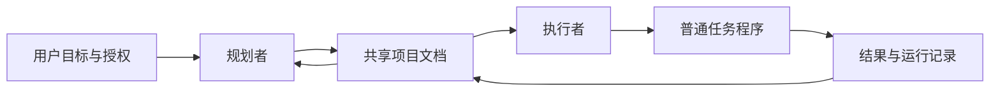

# Long Horizon Agents

**让 agent 直接加载的长期项目 harness。跨会话持续推进工作，把进度留在项目里。**

一个规划者审查方向，一个执行者落实任务；两者通过简明文档协作，按关键结果和预计终点安排接续。适用于持续数天或更久的研究、软件开发、数据处理等工作。

框架使用原生 Agent Skill 入口。agent 加载后自行接入项目、恢复上下文、执行任务和维护交接；模型与调度由所在平台提供。

## 给 agent 一句话安装

把下面这句话发给 Codex：

> 读取并执行 https://raw.githubusercontent.com/rose8happy/long-horizon-agents/main/.codex/INSTALL.md 中的安装说明，然后使用这套 harness 接入当前项目并开始工作。

安装后可以直接说：

```text
使用 $long-horizon-agents，作为执行者接续当前项目。
```

```text
使用 $long-horizon-agents，作为规划者审查项目方向、证据缺口和下一步优先级。
```

在支持隐式 skill 选择的客户端，相关任务可以自动匹配；明确提及 `$long-horizon-agents` 可以让请求指向这套框架。项目接入时追加的 `AGENTS.md` 入口会让后续 agent 继续加载它。

### 加载后 agent 做什么

1. 找到用户指定的 canonical 工作区，保留原指令和已有工作。
2. 已有计划与账本直接映射复用；新项目由 agent 初始化，并根据用户请求填写目标与计划。
3. 按规划者或执行者职责开始实际交付，维护紧凑状态并消费完整结果。
4. 记录重要完成、负结果和可复用经验，按安全边界交接。
5. 在已授权的长期工作中，真正等待时通过平台安排同一角色的下一次接续。

安装脚本只安装 skill；agent 根据用户目标和现有授权接入、工作和安排后继。真实模型、两个持久会话及 scheduled task 使用宿主能力配置，安装不等于这些服务已经启用。

### 手动安装

Python 3.10+，只使用标准库。PowerShell、bash 和 zsh 均可：

```sh
git clone https://github.com/rose8happy/long-horizon-agents.git
cd long-horizon-agents
python scripts/install_skill.py
```

默认安装到 `~/.agents/skills/long-horizon-agents/`。仅为一个项目安装时使用：

```sh
python scripts/install_skill.py --skills-dir ../my-project/.agents/skills
```

相同内容会复用，冲突内容会保留并报告；`--dry-run` 只预览。运行包自包含，安装后可离开原始 clone 使用，不需要符号链接、管理员权限或 API key。若客户端尚未发现新 skill，重新打开会话或重启客户端。其他兼容 Agent Skills 的宿主可加载同一个 [SKILL.md](skills/long-horizon-agents/SKILL.md)，调度按实际能力适配。

## 工作方式



| 角色 | 负责什么 | 主要输出 |
| --- | --- | --- |
| 规划者 | 总览目标、研究问题、证据缺口、优先级和停止条件 | `PLAN.md`、`DECISIONS.md` |
| 执行者 | 实现、分析、排查、任务接续、资源安排与结果交付 | `CURRENT.md`、任务卡、`HISTORY.md` |
| 普通任务程序 | 执行预先确定的步骤，记录真实终态和运行信息 | 日志、退出状态、产物 |

例如可以给规划者选 Astra，给执行者选 GPT‑6.1 Sol。实际模型通过客户端或运行平台设置；仓库中的配置只是可修改的示例。只有一个会话时可临时兼任两种职责，增加规划者后明确交接文档所有权。

## 单独使用项目模板

需要 Python 3.10+，无需安装 Python 依赖。以下命令可以在 PowerShell、bash 或 zsh 中运行。

**新项目**：在 GitHub 点击 **Use this template → Create a new repository**，克隆生成的仓库后，在其中运行：

```sh
python scripts/init_project.py --target . --name "我的长期项目"
```

**已有项目**：将模板仓库拉到旁边，再指定你的项目目录：

```sh
git clone https://github.com/rose8happy/long-horizon-agents.git
cd long-horizon-agents
python scripts/init_project.py --target ../my-project --name "我的长期项目" --dry-run
python scripts/init_project.py --target ../my-project --name "我的长期项目"
```

也可以下载公有仓库 ZIP，解压后运行脚本。已有项目若已有目标、计划和账本，agent 使用 `.agent/PROJECT.md` 映射复用原记录，避免另建平行账本。

初始化会生成：

```text
my-project/
├── AGENTS.md                       # 追加 skill 加载入口，保留原指令
├── .agent/
│   ├── agent.config.example.toml   # 模型与工作区配置示例
│   ├── roles/{planner,executor}.md
│   └── codex/                     # 接入说明与两种唤醒提示
└── docs/agent/
    ├── README.md
    ├── MISSION.md
    ├── PLAN.md
    ├── CURRENT.md
    ├── DECISIONS.md
    ├── HISTORY.md
    └── templates/TASK.md
```

现有文件会保留；再次运行会跳过已存在的模板，不会恢复模板覆盖你的修改。初始化不会创建会话、调用模型、安装依赖、创建 scheduled task 或运行项目任务。

### 启动两个角色

1. 让 agent 根据已有用户请求整理目标、完成判据、授权与工作区；必要信息缺失时才提问。
2. 为两个角色打开独立会话，并让它们读取同一个 canonical 工作区。
3. 在规划者会话中发送：

   > 使用 `$long-horizon-agents` 作为规划者，建立当前计划，找出最有价值的未解决问题，明确执行者可自主推进的范围。

4. 在执行者会话中发送：

   > 使用 `$long-horizon-agents` 作为执行者，接续已授权任务并完成具体交付；只有真正等待依赖时才安排下一次唤醒。

5. 用户授权长期接续后，agent 使用 `.agent/codex/` 提示模板管理各自的 scheduled task；首轮开始实际工作，按依赖和预计终点接续。

远程项目应把上述文件初始化到远端 canonical 仓库，两个角色都通过同一入口读写；本机历史副本不能承担共享状态。

## 五份核心文档

| 文档 | 回答的问题 | 写入负责人 |
| --- | --- | --- |
| `MISSION.md` | 用户要完成什么，什么算完成，授权到哪里？ | 用户；规划者忠实整理 |
| `PLAN.md` | 接下来最值得做什么，为什么，依赖什么？ | 规划者 |
| `CURRENT.md` | 实际进展、下一动作、阻断和下次接续时刻是什么？ | 执行者 |
| `DECISIONS.md` | 为什么选择或停止某个方向，什么证据会改变判断？ | 规划者汇总；执行者提供证据 |
| `HISTORY.md` | 过去哪些重要任务完成了，哪些经验和产物可复用？ | 执行者 |

详细任务使用[任务卡](skills/long-horizon-agents/assets/templates/project/TASK.md)，详细结果和日志留在原位置并链接。无需每次唤醒通读历史，也无需把同一状态复制到多个文件。

## 核心约定

- 用户目标与明确授权优先；agent 生成的计划不能自行缩减目标或新增无依据限制。
- 执行者自主处理已授权范围内的常规实现和恢复，重要方向变化提交证据供规划者判断。
- 规划更新带版本号，在安全边界生效；运行中的任务保持原合同。
- 每个资源只有一个负责发车的执行者；规划者通过文档交接安排。
- 重要任务完成判据包含结果交付，避免把“进程启动”或“某阶段完成”当成整个目标完成。
- 等待一个结果只阻塞它的后继。独立准备和分析继续推进，准备好可执行的接棒任务。
- 真正等待时按预计终点唤醒。没有新信息就保持安静；短步骤由程序接续。
- 身份检查、资源检查和测试服务具体风险；已有证据可复用，费用记录与费用准入分开。
- 历史包含重要成功、负结果和失败。旧结论写明适用范围，可以被新证据修正。

完整约定见 [协作与恢复](skills/long-horizon-agents/references/protocol.md)，调度见 [Codex 接入](skills/long-horizon-agents/assets/adapters/codex/setup.md)。

## 运行包

```text
skills/long-horizon-agents/    # 自包含维护源
  SKILL.md                   # 加载、角色路由、执行与恢复
  agents/openai.yaml         # 原生发现元数据，允许隐式匹配
  references/                # 按需读取的接入和协议
  assets/                    # 项目模板、角色、宿主适配
  scripts/init_project.py    # 保留已有文件的初始化器
.codex/INSTALL.md             # agent 可直接执行的安装说明
scripts/install_skill.py      # 原生 discovery 目录安装器
scripts/init_project.py       # 原命令兼容入口
```

旧 `roles/`、`templates/`、`adapters/` 路径保留为阅读入口；维护源在自包含 skill 中。

## 示例与检查

- [研究项目：新方法与对照的完整比较](examples/research-project/README.md)
- [软件项目：可接续的数据迁移](examples/software-project/README.md)
- [恢复演练与有效性检查](docs/recovery-and-evaluation.md)

运行初始化脚本的测试：

```sh
python -m unittest discover -s tests -v
```

## 范围与后续维护

框架通过 skill 驱动职责、共享状态、交接和恢复。具体训练、迁移、下载程序由项目提供；真实模型调用和调度由平台提供。可以配合 Superpowers 等专业 coding skills 使用。

更新模板仓库后，在已接入项目中运行 `--dry-run` 查看缺失文件。现有文件不会自动升级，按需要人工或由 agent 合并具体改进。仓库改动使用可追溯的 Git 提交；重要行为变化写入 [CHANGELOG.md](CHANGELOG.md)。

## 参考

- [Superpowers](https://github.com/obra/superpowers)：可组合的 coding skills 与开发流程。
- [OpenAI 官方 skills 文档](https://learn.chatgpt.com/docs/build-skills)：原生发现、显式调用和隐式匹配。
- [Anthropic：Effective harnesses for long-running agents](https://www.anthropic.com/engineering/effective-harnesses-for-long-running-agents)：跨上下文的进度与交接实践。
- [OpenAI 官方 scheduled tasks 文档](https://learn.chatgpt.com/docs/automations)：会话内接续、独立定时任务及平台边界。

本仓库是独立实现。上述项目作为参考链接；示例均为虚构，不包含私人项目数据。

## 许可

[MIT](LICENSE)。
